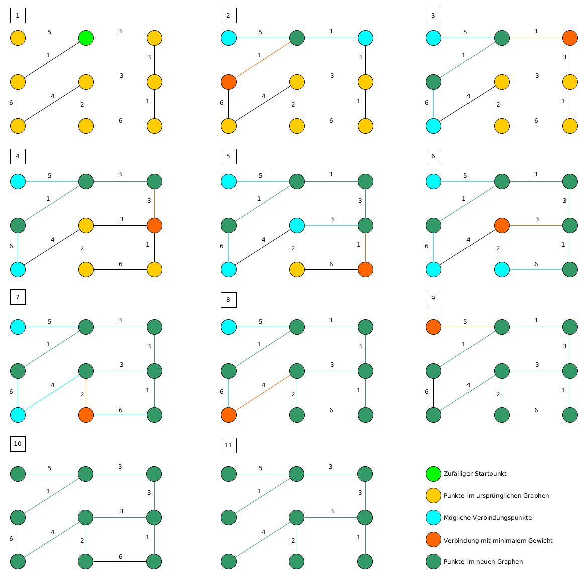

# Graphentheorie

## Algorithmus von Prim

`Cyril, Sanchaai und Rafael`

### Infos

1930 vom tschechischen Mathematiker Vojtěch Jarník entwickelt.
1957 von Robert C. Prim wiederentdeckt
1959 von Edsger W. Dijkstra wiederentdeckt

### Welches Problem löst dieser Algorithmus?

Er findet den minimalen Spannbaum eines zusammenhängenden, kantengewichteten Graphen.

### Wie läuft er ab?

1. Es wird ein zufälliger Knoten auf dem Graph ausgewählt.
2. Von diesem Knoten wird eine anliegende Kante mit minimalem Gewicht und der dazugehörige Knoten zum Graph hinzugefügt.
3. Anschliessend wird ein noch nicht erschlossener Knoten mit einer Verbindungskante mit minimalem Gewicht zum Graph hinzugefügt.
4. Schritt 3 wird wiederholt, bis alle Punkte erschlossen sind.

### Warum liefert er immer das korrekte Ergebnis?

-

### Gibt es Einschränkungen hinsichtlich der Gültigkeit?

Nein.
